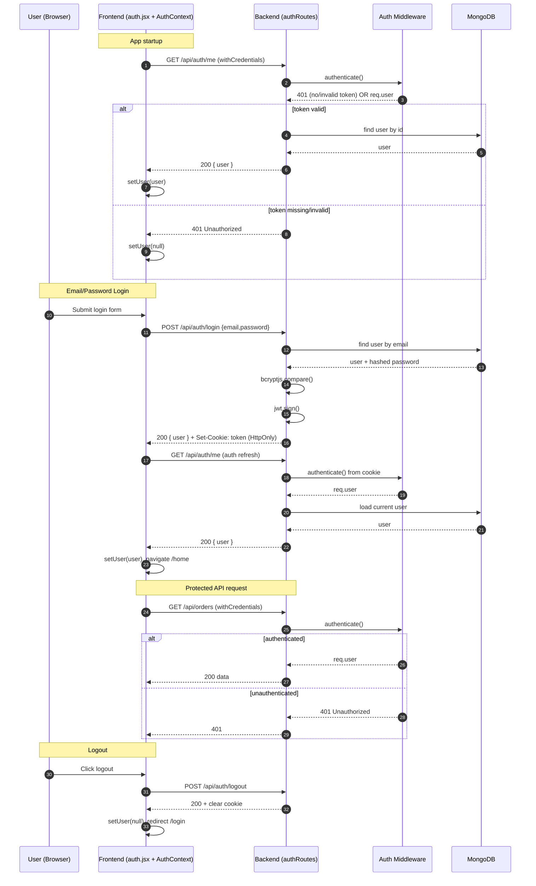

<div align="center">

# ReCarNation

### A full-stack used car marketplace — buy, sell, and manage pre-owned vehicles with confidence.

[](https://s64-harsh-singh-cap-stone-re-car-na.vercel.app/)
[](https://recarnation.onrender.com)
[](LICENSE)
[](https://nodejs.org)

</div>

---

## Project Overview

**ReCarNation** is a modern, full-stack web marketplace designed to simplify the process of buying and selling used cars in India. It features a complete authentication system (JWT + Google OAuth), role-based access control, Razorpay payment integration, image upload via Cloudinary, AI-assisted car details auto-complete, and a Dockerized deployment pipeline — all built on a clean RESTful API architecture.

> This is a Kalvium Capstone project by **Harsh Singh** (Batch 64), representing a complete end-to-end implementation with CI/CD, containerization, and cloud deployment.

---

## Key Features

| Feature | Description |
|---|---|
| **Authentication** | Email/password signup, Google OAuth 2.0, JWT tokens, HTTP-only cookies |
| **Role-Based Access** | Three roles: `buyer`, `seller`, `admin` — with protected route enforcement |
| **Car Listings** | Sellers can create, update, and delete listings with up to 10 images per car |
| **Smart Search & Filter** | Filter by make, model, year, price, transmission, fuel type, and keywords |
| **AI Autocomplete** | Gemini AI-powered autocomplete for car details when listing a vehicle |
| **Razorpay Payments** | Full payment lifecycle: create order → verify → refund |
| **Order Management** | Buyers can place orders, track status, arrange meetings, and cancel orders |
| **Wishlist** | Save and manage favourite listings (unique per user per product) |
| **User Verification** | Email-based identity verification with status tracking |
| **Image Management** | Cloudinary-backed multi-image upload, per-image delete, and Multer middleware |
| **Dockerized** | Full Docker Compose setup for both production and development environments |
| **Health Check** | `/health` endpoint for container orchestration and uptime monitoring |
| **Frontend Tests** | Jest + React Testing Library for component-level testing |

---

## Technology Stack

### Frontend

| Technology | Purpose |
|---|---|
| **React 18** | Component-based UI framework |
| **Vite** | Lightning-fast dev server and build tool |
| **React Router v6** | Client-side routing and protected routes |
| **TailwindCSS v3** | Utility-first styling |
| **shadcn/ui + Radix UI** | Accessible, headless UI primitives |
| **TanStack Query v5** | Server state management and caching |
| **React Hook Form + Zod** | Form handling and schema validation |
| **Axios** | HTTP client for API calls |
| **Recharts** | Data visualization / charts |
| **Embla Carousel** | Image carousel in car detail pages |
| **Sonner + React Hot Toast** | Toast notification system |
| **Jest + Testing Library** | Unit and component testing |

### Backend

| Technology | Purpose |
|---|---|
| **Node.js (≥18)** | JavaScript runtime |
| **Express.js v5** | HTTP server and routing |
| **MongoDB + Mongoose** | NoSQL database and ODM |
| **Passport.js** | Authentication strategies (JWT + Google OAuth) |
| **JSON Web Tokens (JWT)** | Stateless auth token generation and verification |
| **bcrypt / bcryptjs** | Password hashing |
| **Multer** | Multipart file upload handling |
| **Cloudinary SDK** | Cloud image storage and delivery |
| **Razorpay SDK** | Payment gateway integration |
| **Google Auth Library** | Server-side Google token verification |
| **@google/generative-ai** | Gemini AI for autocomplete and chat |
| **Groq API** | Alternative LLM service for AI features (fallback) |
| **ioredis** | Redis client for distributed rate limiting & caching |
| **express-rate-limit** | Rate limiting middleware with Redis support |
| **helmet** | HTTP security headers |
| **express-mongo-sanitize** | NoSQL injection prevention |
| **xss** | XSS sanitization library |
| **cookie-parser** | HTTP cookie parsing |
| **express-session** | Session management for OAuth flow |
| **cors** | Cross-origin resource sharing |
| **dotenv** | Environment variable loading |

### DevOps & Infrastructure

| Technology | Purpose |
|---|---|
| **Docker + Docker Compose** | Containerized multi-service deployments |
| **Nginx** | Frontend static file serving in production container |
| **Vercel** | Frontend hosting and CDN |
| **Render** | Backend hosting (Node.js service) |
| **GitHub** | Version control, issues, PRs |

---

## Project Structure

```
ReCarNation/
├── backend/
│   ├── config/                  # DB and service configurations
│   ├── db/                      # Database connection + init scripts
│   ├── features/
│   │   ├── auth/                # Auth controllers, routes, middleware
│   │   │   ├── authController.js
│   │   │   ├── authRoutes.js
│   │   │   ├── verificationController.js
│   │   │   ├── verificationRoutes.js
│   │   │   └── authMiddleware/  # JWT, Passport, combined middleware
│   │   ├── products/            # Car listings CRUD
│   │   ├── orders/              # Order management
│   │   ├── payments/            # Razorpay lifecycle
│   │   ├── wishlist/            # User wishlists
│   │   ├── autocomplete/        # Gemini AI integration
│   │   └── middleware/          # Shared middleware (upload)
│   ├── model/
│   │   ├── userModel.js
│   │   ├── productsModel.js
│   │   ├── orderModel.js
│   │   └── wishlistModel.js
│   ├── uploads/                 # Temporary local upload storage
│   ├── server.js                # Express app entry point
│   └── package.json
│
├── frontend/
│   ├── public/
│   ├── src/
│   │   ├── assets/
│   │   ├── components/          # Reusable UI components
│   │   │   ├── navbar.jsx
│   │   │   ├── footer.jsx
│   │   │   ├── SearchBar.jsx
│   │   │   ├── filter.jsx
│   │   │   ├── productCards.jsx
│   │   │   ├── ProtectedRoute.jsx
│   │   │   ├── ErrorBoundary.jsx
│   │   │   └── ui/              # shadcn/ui components
│   │   ├── context/
│   │   │   └── AuthContext.jsx  # Global auth state
│   │   ├── pages/
│   │   │   ├── home.jsx
│   │   │   ├── auth.jsx         # Login + Register
│   │   │   ├── browseCars.jsx
│   │   │   ├── carDetails.jsx
│   │   │   ├── sellCar.jsx
│   │   │   ├── orders.jsx
│   │   │   ├── payment.jsx
│   │   │   ├── OrderConfirmation.jsx
│   │   │   ├── Wishlist.jsx
│   │   │   ├── profile.jsx
│   │   │   ├── profilePages/    # Settings, Consent, Listed Cars
│   │   │   └── static/          # About, Contact, Help, Terms, Privacy
│   │   ├── lib/
│   │   ├── utils/
│   │   ├── App.jsx              # Root component + routing
│   │   └── main.jsx
│   ├── nginx.conf               # Nginx config for production container
│   └── package.json
│
├── docker-compose.yml           # Production compose (frontend + backend + mongo)
├── docker-compose.dev.yml       # Dev compose (with hot-reload volumes)
├── .env.example                 # Environment variable template
├── MIGRATION_PLAN.md            # MongoDB → Neon DB migration plan
└── README.md
```

---

## API Reference

### Auth — `/api/auth`

| Method | Endpoint | Auth | Description |
|---|---|---|---|
| `POST` | `/signup` | | Register with email and password |
| `POST` | `/login` | | Login and receive JWT cookie |
| `POST` | `/logout` | | Clear auth cookie |
| `GET` | `/me` | | Get current authenticated user |
| `GET` | `/profile` | | Get detailed user profile |
| `PUT` | `/profile` | | Update user profile details |
| `PUT` | `/role` | | Update user role (buyer → seller) |
| `POST` | `/profile/image` | | Upload profile picture |
| `GET` | `/google` | | Initiate Google OAuth flow |
| `GET` | `/google/callback` | | Google OAuth callback handler |
| `GET` | `/emails` | | Get all users (public — for admin/debugging) |

### Verification — `/api/verify`

| Method | Endpoint | Auth | Description |
|---|---|---|---|
| `GET` | `/me` | | Get current user info |
| `POST` | `/verify` | | Submit verification details |
| `POST` | `/verify/email` | | Start email verification |
| `GET` | `/verify/status` | | Check verification status |
| `GET` | `/check` | | Check authentication status |

### Products — `/api/products`

| Method | Endpoint | Auth | Description |
|---|---|---|---|
| `GET` | `/` | | Get all listings (paginated, filterable) |
| `GET` | `/metadata` | | Get metadata for filters (makes, models, etc.) |
| `GET` | `/:id` | | Get single product by ID |
| `POST` | `/` | Seller/Admin | Create a new car listing (with images) |
| `PUT` | `/:id` | Owner | Update a listing |
| `DELETE` | `/:id` | Owner | Delete a listing |
| `GET` | `/mine` | | Get listings by the logged-in user |
| `GET` | `/admin/all` | Admin | Get all listings (admin view) |
| `POST` | `/:id/images` | | Add images to a listing |
| `DELETE` | `/:id/images/:imageId` | | Remove a specific image |

### Orders — `/api/orders`

| Method | Endpoint | Auth | Description |
|---|---|---|---|
| `POST` | `/` | | Create a new order (buyer initiates) |
| `GET` | `/` | | Get all orders for the logged-in user |
| `GET` | `/:orderId` | | Get specific order details |
| `PUT` | `/:orderId/payment` | | Update payment status on order |
| `PUT` | `/:orderId/cancel` | | Cancel an order |

### Payments — `/api/payments`

> All payment routes require authentication.

| Method | Endpoint | Description |
|---|---|---|
| `POST` | `/create-order` | Create a Razorpay order object |
| `POST` | `/verify` | Verify Razorpay payment signature |
| `GET` | `/:orderId` | Get payment details for an order |
| `POST` | `/refund` | Initiate a refund for a payment |

### Wishlist — `/api/wishlist`

| Method | Endpoint | Auth | Description |
|---|---|---|---|
| `GET` | `/` | | Get the logged-in user's wishlist |
| `POST` | `/` | | Add a product to wishlist |
| `DELETE` | `/:productId` | | Remove a product from wishlist |

### Autocomplete — `/api/autocomplete`

| Method | Endpoint | Description |
|---|---|---|
| `POST` | `/` | Generate AI-powered car search query suggestions |
| `POST` | `/ask` | Chat with AI Assistant for car/platform questions |

> Autocomplete endpoint generates optimized search queries (make, model, year, budget, etc.) from natural language.
> 
> Ask endpoint provides Gemini/Groq-powered answers about:
> - Used car market, maintenance, finance tips
> - ReCarNation platform features and policies
> - Safety guardrails prevent off-topic responses (medical, legal, politics, etc.)

### Health — `/health`

| Method | Endpoint | Description |
|---|---|---|
| `GET` | `/health` | Returns server status, uptime, and environment |

---

## Security Features

The backend implements multiple layers of security:

### Rate Limiting
- **Auth Limiter**: 10 attempts per 15 minutes on `/login` and `/signup` (prevents brute-force)
- **API Limiter**: 60 requests per minute globally on `/api/*` routes
- **Upload Limiter**: 20 file uploads per hour (prevents abuse)
- **Redis Support**: Distributed rate limiting via Redis Cloud (optional; graceful fallback to in-memory)

### Input Validation & Sanitization
- **NoSQL Injection Prevention**: Strips MongoDB operators (`$`, `.`) from request body, params, and query
- **XSS Protection**: Sanitizes all string inputs using the `xss` library
- **Express Validator**: Schema validation on signup, login, profile updates
- **Helmet.js**: Sets HTTP security headers (X-Frame-Options, HSTS, X-Content-Type-Options, etc.)

### Authentication & Authorization
- **JWT Tokens**: HTTP-only cookies with expiration (1 hour)
- **Passport.js**: Multiple strategies (JWT + Google OAuth 2.0)
- **Protected Routes**: Role-based access control (buyer, seller, admin)
- **Session Management**: Secure session storage for OAuth flow

### Data Protection
- **Password Hashing**: bcryptjs with salt rounds
- **Environment Secrets**: Sensitive keys never hardcoded (JWT_SECRET, DB credentials, API keys)
- **CORS**: Strict origin whitelist via `FRONTEND_URL` env variable
- **Cookie Security**: Secure + HttpOnly + SameSite flags in production

---

## Authentication Flow



```mermaid
flowchart TD
  A[auth.jsx submit] --> B[POST /api/auth/login]
  B --> C{Credentials valid?}
  C -- No --> D[401 Invalid credentials]
  C -- Yes --> E[Set HttpOnly JWT cookie]
  E --> F[AuthContext checkAuth()]
  F --> G[GET /api/auth/me]
  G --> H{Middleware token check}
  H -- Invalid/Missing --> I[user = null]
  H -- Valid --> J[user loaded]
  J --> K[user in context]
  K --> L[ProtectedRoute allows page]
```

---

## Payment Flow (Razorpay)

```
Buyer clicks Pay
      │
      
POST /api/payments/create-order  ──  Creates Razorpay order object
      │
      
Razorpay Checkout UI (client-side JS)
      │
       (on success)
POST /api/payments/verify  ──  Verifies HMAC signature
      │
      
Order status → "completed", paymentStatus → "completed"
      │
       (optional)
POST /api/payments/refund  ──  Razorpay refund initiated
```

---

## Docker Setup

### Production

```bash
# Copy and fill environment variables
cp .env.example .env

# Build and start all services (frontend, backend, MongoDB)
docker-compose up --build
```

Services:
- **Frontend** → `http://localhost:80`
- **Backend** → `http://localhost:3000`
- **MongoDB** → `localhost:27017`

> **Note**: Redis is not included in the Docker Compose setup. For distributed rate limiting in production, add your Redis Cloud URL to the `.env` file under `REDIS_URL`. The system gracefully falls back to in-memory rate limiting if Redis is unavailable.

### Development (with hot-reload)

```bash
docker-compose -f docker-compose.dev.yml up --build
```

Services:
- **Frontend** → `http://localhost:5173` (Vite HMR)
- **Backend** → `http://localhost:3000` (Nodemon)
- **MongoDB** → `localhost:27017`

---

## Local Setup (Without Docker)

### Prerequisites
- Node.js ≥ 18
- MongoDB (local or Atlas)
- Cloudinary account
- Google Cloud Console OAuth credentials
- Razorpay account

### 1. Clone & Install

```bash
git clone https://github.com/kalviumcommunity/s64_HarshSingh_CapStone_ReCarNation.git
cd s64_HarshSingh_CapStone_ReCarNation
```

### 2. Backend Setup

```bash
cd backend
npm install
```

Create a `.env` file in `/backend`:

```env
# Server
PORT=3000
NODE_ENV=development
FRONTEND_URL=http://localhost:5173
SESSION_SECRET=your-session-secret

# Database
MONGODB_URI=mongodb://localhost:27017/recarnation

# JWT
JWT_SECRET=your-jwt-secret

# Google OAuth
GOOGLE_CLIENT_ID=your-google-client-id
GOOGLE_CLIENT_SECRET=your-google-client-secret
GOOGLE_CALLBACK_URL=http://localhost:3000/api/auth/google/callback

# Cloudinary
CLOUDINARY_CLOUD_NAME=your-cloud-name
CLOUDINARY_API_KEY=your-api-key
CLOUDINARY_API_SECRET=your-api-secret

# Razorpay
RAZORPAY_KEY_ID=your-key-id
RAZORPAY_KEY_SECRET=your-key-secret

# Gemini AI
GEMINI_API_KEY=your-gemini-api-key
GEMINI_MODEL=gemini-1.5-flash

# Groq AI (Alternative/Fallback)
GROQ_API_KEY=your-groq-api-key
GROQ_MODEL=llama-3.1-8b-instant

# Redis (Optional — enables distributed rate limiting & caching)
REDIS_URL=rediss://:your-password@your-redis-host:6380
```

```bash
npm run dev     # Start with Nodemon
# or
npm start       # Production start
```

### 3. Frontend Setup

```bash
cd frontend
npm install
```

Create a `.env` file in `/frontend`:

```env
# Frontend API Configuration
VITE_API_URL=http://localhost:3000
VITE_RAZORPAY_KEY_ID=your-razorpay-key-id
```

```bash
npm run dev       # Start Vite dev server
npm run build     # Production build
npm run test      # Run Jest tests
npm run lint      # Run ESLint
```

---

## Application Routes

| Route | Access | Description |
|---|---|---|
| `/` | Public | Home page |
| `/browse` | Public | Browse all car listings |
| `/car/:id` | Public | Car detail page |
| `/login` | Public | Login / Register |
| `/about` | Public | About ReCarNation |
| `/contact` | Public | Contact page |
| `/help` | Public | Help center |
| `/terms` | Public | Terms of Service |
| `/privacy` | Public | Privacy Policy |
| `/profile` | Auth | User profile |
| `/profile-settings` | Auth | Edit profile settings |
| `/orders` | Auth | View orders |
| `/wishlist` | Auth | Saved/wishlist cars |
| `/messaging/:id` | Auth | Messaging page |
| `/order-confirmation/:id` | Auth | Post-order confirmation |
| `/payment/:orderId` | Auth | Payment flow |
| `/sellCar` | Seller/Admin | Create a new listing |
| `/listed-cars` | Seller/Admin | Manage own listings |

---

## Database Schema

### `users`
| Field | Type | Description |
|---|---|---|
| `name` | String | Display name |
| `email` | String (unique) | Primary identifier |
| `googleId` | String | Google OAuth ID |
| `password` | String (hidden) | Hashed password |
| `profilePicture` | String | Cloudinary URL |
| `role` | Enum | `buyer` / `seller` / `admin` |
| `isVerified` | Boolean | Identity verification status |
| `verifiedWith` | Enum | `phone` / `email` |
| `bio` | String (≤500) | User bio |
| `phone` | String | Contact number |
| `location` | String | User's city/area |
| `lastLogin` | Date | Last login timestamp |
| `createdAt`, `updatedAt` | Date | Timestamps |

### `products`
| Field | Type | Description |
|---|---|---|
| `make` | String | Car brand (e.g., Honda) |
| `model` | String | Car model (e.g., City) |
| `year` | Number | Year of manufacture |
| `trim` | String | Variant (optional) |
| `mileage` | Number | Odometer reading (km) |
| `price` | Number | Asking price (₹) |
| `transmission` | Enum | `automatic` / `manual` / `cvt` / `dualClutch` |
| `fuelType` | Enum | `petrol` / `diesel` / `hybrid` / `electric` / `cng` |
| `description` | String | Free-text description |
| `location` | String | Where the car is located |
| `contactNumber` | String | Seller's contact |
| `images` | Array | `[{ url, publicId }]` (Cloudinary) |
| `listedBy` | ObjectId → User | Reference to seller |
| `status` | Enum | `active` / `sold` / `pending` |
| `isFeatured` | Boolean | Featured listing flag |

### `orders`
| Field | Type | Description |
|---|---|---|
| `buyer` | ObjectId → User | Buyer reference |
| `seller` | ObjectId → User | Seller reference |
| `product` | ObjectId → Product | Listing reference |
| `status` | Enum | `pending` / `processing` / `accepted` / `rejected` / `completed` / `cancelled` |
| `price` | Number | Agreed price |
| `paymentStatus` | Enum | `pending` / `completed` / `failed` / `refunded` / `cancelled` |
| `paymentMethod` | Enum | `cash` / `online` |
| `meetingLocation` | String | Where to meet |
| `meetingDate` | Date | Scheduled meeting |
| `notes` | String | Optional notes |
| `razorpayOrderId` | String | Razorpay order reference |
| `razorpayPaymentId` | String | Razorpay payment reference |
| `razorpaySignature` | String | HMAC signature |
| `paidAt` | Date | Payment timestamp |
| `refundId` | String | Razorpay refund ID |
| `refundedAt` | Date | Refund timestamp |

### `wishlists`
| Field | Type | Description |
|---|---|---|
| `userId` | ObjectId → User | User reference |
| `productId` | ObjectId → Product | Product reference |
| `createdAt` | Date | When added |

> **Compound unique index**: `(userId, productId)` — prevents duplicate wishlist entries.

---

## Deployment

### Frontend — Vercel

- Auto-deploys on push to `main`.
- Build command: `npm run build`
- Output directory: `dist`
- Environment variables configured in Vercel dashboard.

### Backend — Render

- Deploys the Node.js service from the `backend/` directory.
- Start command: `npm start`
- Environment variables configured in Render dashboard.

### Environment Variables Summary

| Variable | Service | Required | Notes |
|---|---|---|---|
| `MONGODB_URI` | Backend | ✓ | Local or Atlas connection string |
| `JWT_SECRET` | Backend | ✓ | Secret for JWT token signing |
| `SESSION_SECRET` | Backend | ✓ | Secret for session encryption |
| `GOOGLE_CLIENT_ID` | Backend | ✓ | Google Cloud OAuth credential |
| `GOOGLE_CLIENT_SECRET` | Backend | ✓ | Google Cloud OAuth credential |
| `CLOUDINARY_CLOUD_NAME` | Backend | ✓ | Cloudinary account name |
| `CLOUDINARY_API_KEY` | Backend | ✓ | Cloudinary API key |
| `CLOUDINARY_API_SECRET` | Backend | ✓ | Cloudinary API secret |
| `RAZORPAY_KEY_ID` | Backend | ✓ | Razorpay merchant key ID |
| `RAZORPAY_KEY_SECRET` | Backend | ✓ | Razorpay merchant secret |
| `GEMINI_API_KEY` | Backend | ✓ | Google AI API key |
| `GEMINI_MODEL` | Backend | | Model name (default: `gemini-1.5-flash`) |
| `GROQ_API_KEY` | Backend | | Groq API key (optional fallback) |
| `GROQ_MODEL` | Backend | | Model name (default: `llama-3.1-8b-instant`) |
| `REDIS_URL` | Backend | | Optional — enables distributed rate limiting |
| `FRONTEND_URL` | Backend | ✓ | Frontend URL for CORS |
| `VITE_API_URL` | Frontend | ✓ | Backend API base URL |
| `VITE_RAZORPAY_KEY_ID` | Frontend | ✓ | Razorpay public key |
| `NODE_ENV` | Backend | | Set to `production` or `development` |

---

## Testing

```bash
# Run all frontend tests
cd frontend && npm test

# Run with coverage report
npm run test:coverage

# Watch mode for TDD
npm run test:watch
```

Tests use **Jest** and **React Testing Library** for component-level assertions. Babel is configured to transpile JSX for the test environment (`jest-environment-jsdom`).

---

## Scripts Reference

### Backend

| Script | Command | Description |
|---|---|---|
| `dev` | `nodemon server.js` | Start with auto-restart |
| `start` | `node server.js` | Production start |

### Frontend

| Script | Command | Description |
|---|---|---|
| `dev` | `vite` | Start development server |
| `build` | `vite build` | Production build |
| `preview` | `vite preview` | Preview production build |
| `lint` | `eslint .` | Run ESLint |
| `test` | `jest` | Run all tests |
| `test:watch` | `jest --watch` | Watch mode |
| `test:coverage` | `jest --coverage` | Generate coverage report |

---

## Roadmap

- [ ] **Migrate database** from MongoDB to Neon DB (PostgreSQL) — see [`MIGRATION_PLAN.md`](./MIGRATION_PLAN.md)
- [ ] Add WebSocket-based real-time messaging
- [ ] Seller analytics dashboard with Recharts
- [ ] Admin panel for content moderation
- [ ] Email notifications for order status changes
- [ ] Mobile app (React Native)

---

## ‍ Author

**Harsh Singh** — Kalvium Batch 64 Capstone Project

---

<div align="center">
Made with  by Harsh Singh | Kalvium Batch 64
</div>
